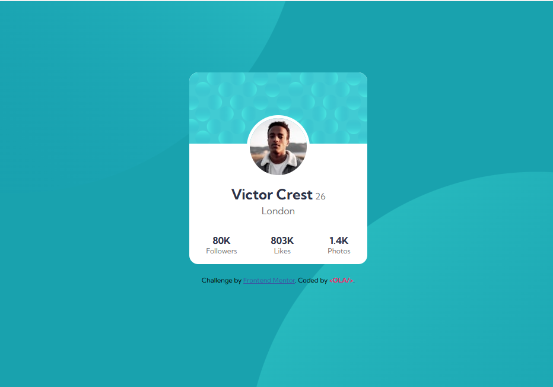

# Frontend Mentor - Profile card component

This is a solution to the [Profile card component
](https://www.frontendmentor.io/challenges/profile-card-component-cfArpWshJ). Frontend Mentor challenges help you improve your coding skills by building realistic projects.

## Table of contents

- [Overview](#overview)
  - [The challenge](#the-challenge)
  - [Screenshot](#screenshot)
  - [Links](#links)
- [My process](#my-process)
  - [Built with](#built-with)
  - [What I learned](#what-i-learned)
  - [Continued development](#continued-development)
- [Author](#author)
- [Acknowledgments](#Acknowledgments)

## Overview

### The challenge

This is a perfect challenge to test your layout skills. The card layout doesn't shift, so it's also great for those that haven't dived into responsive websites yet!

### Screenshot

### Links

- Solution URL: [here](https://github.com/olahasan/HTML_AND_CSS_Frontend-Mentor-very-easy-Profile-card-component)

- Live Site URL: [here](https://olahasan.github.io/HTML_AND_CSS_Frontend-Mentor-very-easy-Profile-card-component/)

## My process

### Built with

- Semantic HTML5 markup
- CSS custom properties
- Flexbox
- Mobile-first workflow

### What I Learned

While working on this project, I learned how to effectively use Flexbox for layout and how to make the design responsive using media queries. I also practiced using CSS variables to manage colors and other design properties.

### Continued Development

In future projects, I plan to continue improving my skills in responsive design and explore more advanced CSS techniques. I also aim to enhance accessibility features in my projects.

### Author

Frontend Mentor - @olahasan 
GitHub - @olahasan

### Acknowledgments

Thanks to **Frontend Mentor** for providing this challenge and to the community for their support and feedback
